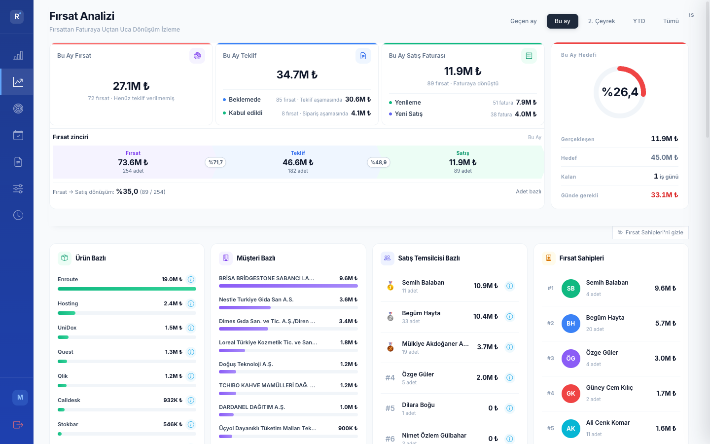
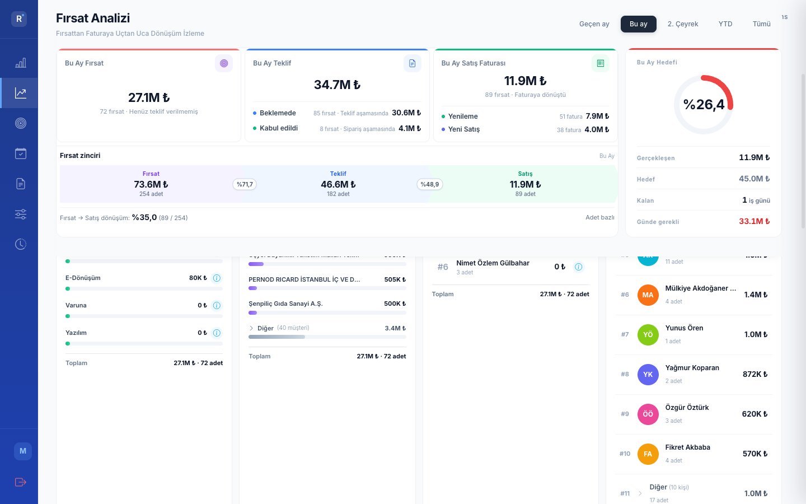
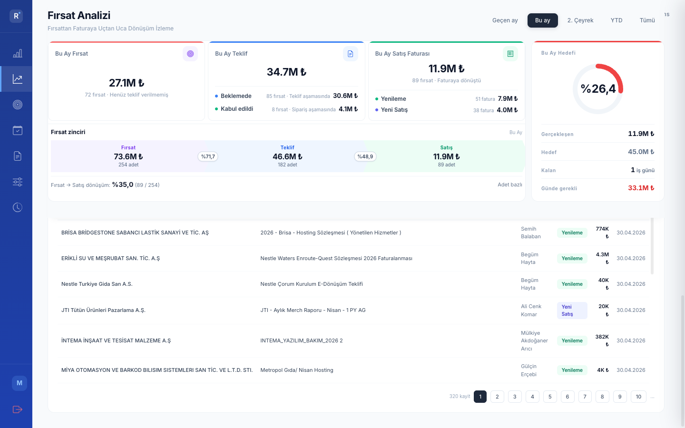
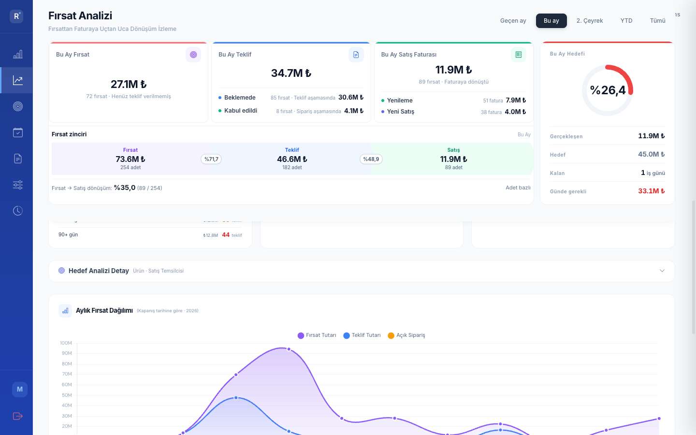
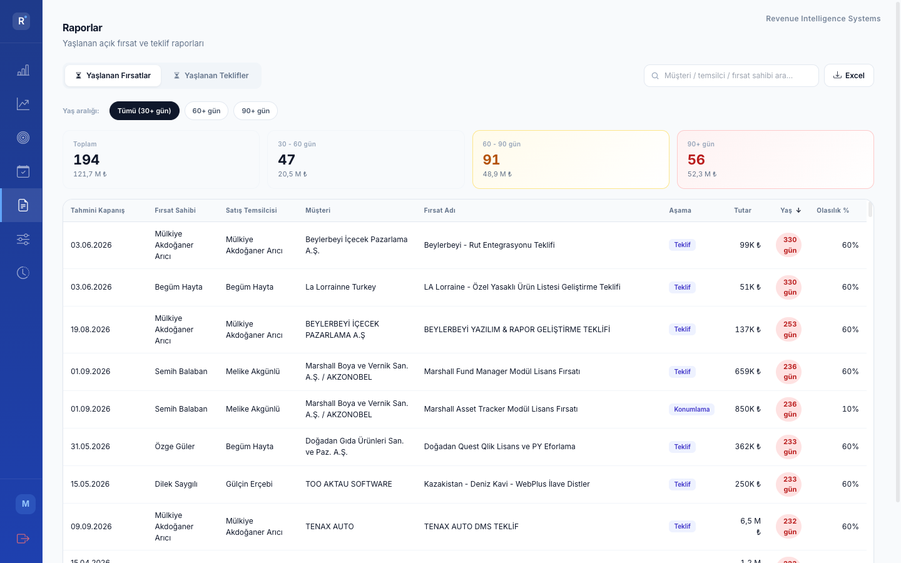

# Fırsat Analizi — Kullanıcı Rehberi

> Bu rehber, Fırsat Analizi sayfasındaki kartları **nasıl yorumlayacağınızı** ve **CRM'de hangi alanları doldurmanız gerektiğini** anlatır.
> *"Fırsatım ekranda görünmüyor"* veya *"sayılar tutmuyor"* gibi durumlarda önce bu rehbere bakın.

---

## 1. Önce şunu anlayalım: Pipeline'da nerede ise orada görünür

Bir fırsat dashboard'da **pipeline'ın hangi aşamasında** ise o kartta sayılır. Aşamalar:

```
  Fırsat   →   Teklif   →   Sipariş   →   Fatura
  (henüz       (Beklemede     (Kabul       (Faturalandı)
   teklif       /             edildi)
   yok)         Kabul edildi)
```

Yani bir fırsat **bağlı teklifi** olduğunda "Bu Ay Fırsat" kartından çıkar, "Bu Ay Teklif" kartına geçer. **Faturası** kesildiğinde "Bu Ay Satış Faturası"na geçer.

> ⚠️ **Kaybedilen fırsatlar (Lost) dashboard'a girmez.** İş olmayacağı için ana kartlarda **bilinçli olarak** sayılmaz. (CRM'de Lost işaretledikten sonra fırsatın sayımdan düşmesi normaldir.)

> 💡 *"30 Nisan bitişli 7 fırsatım var, dashboard sadece 2 gösteriyor"* tipinde bir sorunuz varsa: **kayıp olan fırsat yok**. 5 tanesi zaten teklif aşamasına geçmiş olduğundan **"Bu Ay Fırsat" kartında değil**, **"Bu Ay Teklif" kartının altında** görünüyor. Hepsi sayım içinde.

---

## 2. Üst kartlar ne anlama geliyor?



### 2.1 Bu Ay Fırsat
**Anlamı:** *Sadece fırsatı olan*, henüz teklif girilmemiş açık fırsatlar.

| Kontrol | Olmalı |
|---|---|
| Tahmini Kapanış Tarihi | Bu ay içinde (örn. 30.04.2026) |
| Aşama | Lost / Won / Closed olmamalı |
| Bağlı teklif | **Yok** (teklif girildiği anda fırsat bu karttan çıkar, "Bu Ay Teklif"e geçer) |

> 🔍 *"Fırsatım Bu Ay Fırsat'ta görünmüyor"* dendiğinde **2 şey kontrol edilir**:
> 1. CRM'de **Tahmini Kapanış Tarihi** bu aya çekilmiş mi?
> 2. Bu fırsat için **bir teklif girilmiş mi**? (Girildiyse fırsat artık burada değil — "Bu Ay Teklif" kartında.)

---

### 2.2 Bu Ay Teklif (2 alt-kart: Beklemede + Kabul edildi)

**Anlamı:** Bir fırsat için teklif girilmiş ve dönem bu fırsatın kapanışı. İki alt grup:

| Alt-kart | Anlamı |
|---|---|
| **Beklemede** | Teklif müşteriye sunulmuş ama henüz cevap gelmemiş |
| **Kabul edildi** | Müşteri teklifi kabul etmiş, sipariş aşamasında |

> 🔍 *"Teklifim Beklemede'de görünmüyor"* dendiğinde:
> 1. Teklif gerçekten **müşteriye gönderildi mi**? Hâlâ taslakta (Draft) duruyorsa **sayılmaz** — sistem sadece müşteriye sunulmuş teklifleri açık sayar.
> 2. Bağlı fırsatın **Tahmini Kapanış Tarihi** bu ay mı?

> 🔍 *"Teklifim Kabul edildi'ye geçmedi"* dendiğinde:
> - CRM'de teklif **Onaylı / Kabul edildi** olarak işaretlendi mi?

---

### 2.3 Bu Ay Satış Faturası
**Anlamı:** Sipariş kapanmış ve fatura kesilmiş işler. Hedefi besleyen tek kalemdir.

| Kontrol | Olmalı |
|---|---|
| Sipariş durumu | Kapanmış (Closed) |
| Fatura tarihi | Bu ay içinde (veya tahakkuk override girilmiş) |

> 🔍 *"Faturam görünmüyor"* dendiğinde:
> - Sipariş **Kapatıldı** statüsüne geçti mi?
> - Fatura tarihi gerçekten bu ay mı, yoksa farklı aya mı düştü? (Tahakkuk Yönetimi'nden override girilebilir.)

---

### 2.4 Bu Ay Hedefi
**Anlamı:** Aylık ciro hedefine göre gerçekleşme oranı.

- **Gerçekleşen** = Bu Ay Satış Faturası (yukarıdaki kart)
- **Hedef** = Aylık genel hedef (Hedef Yönetimi'nden tanımlı)
- **Kalan iş günü** = Ay sonuna kalan iş günü
- **Günde gerekli** = (Hedef − Gerçekleşen) ÷ Kalan iş günü

> 💡 Hedef hesabı **sadece faturalanmış işi** sayar. Açık teklifler veya beklemedeki siparişler hedefe katkı vermez.

---

## 3. Fırsat Sahibi vs Satış Temsilcisi — *aynı şey değil!*

Sayfada iki ayrı kart vardır ve **biri Fırsat Sahibi, diğeri Satış Temsilcisi**. Aynı fırsat için iki farklı kişi olabilir, bu **doğru çalışıyor**.



| Kart | Kim? | Nereden gelir? |
|---|---|---|
| **Satış Temsilcisi Bazlı** | Müşterinin sorumlu temsilcisi | Müşteri kartından (Account Rep) |
| **Fırsat Sahipleri** | Fırsatı CRM'de açan kişi | Fırsatın Owner alanı |

> 🔍 *"Bir fırsatta benim adım, bir başkasında satışçının adı yazıyor"* — bu **anormal değil**:
> - Fırsatı **siz açtıysanız** → Fırsat Sahibi olarak siz görünürsünüz
> - **Satış Temsilcisi** ise müşteri kartına atanmış kişi — siz olabilirsiniz, başkası da olabilir
> - Sayfada her iki bilgi de görünür. Ekipteki yönetici hem **kim açtı** hem **kim takip ediyor** bilgisini ister.

> 💡 Eğer müşteri kartında satış temsilcisi atanmamışsa, sistem 4 kademeli bir kural ile bulmaya çalışır:
> 1. Yeni Satış Temsilcisi tablosu (Excel)
> 2. Eski CRM Satış Temsilcisi tablosu (aktif)
> 3. Fırsattaki "Müşteri Temsilcisi" alanı
> 4. Son çare: fırsatı açan kişi (Owner)
>
> Doğru sonuç için müşteri kartına temsilci ataması yapılmış olmalı.

---

## 4. Filtre nasıl çalışıyor?

Sayfanın iki ayrı filtre seti vardır:

| Filtre | Yeri | Etkisi |
|---|---|---|
| **Dönem chip'leri** (Geçen ay / Bu ay / 2. Çeyrek / YTD / Tümü) | Sağ üstte | **Tüm sayfa** — kartlar, tablo, listeler |
| **Temsilci açılır listesi** ("Tüm Temsilciler") | Fırsat Detayları tablosunun üstünde | **Sadece detay tablosu** |

> 🔍 *"Üstteki kartlarda 5 görünüyor ama detay tabloda 7 var"* dendiğinde:
> - Üst kartlar **dönem filtresi** ile çalışır
> - Detay tablo **dönem + temsilci filtresi** ile çalışır
> - İki filtrenin sınırı farklı olduğundan sayılar tutmayabilir, **bu beklenen davranış**.



---

## 5. Yaşlanan fırsat ve teklifler



Sol kartta üç bilgi vardır:

- **Fırsat kapanış ortalaması** — son 3 aydaki kapanmış işlerin "fırsat oluşturuldu → fatura kesildi" süresi
- **Yaşlanan fırsatlar** — açık fırsatların ne kadar uzun süredir bekledikleri (30-60 gün / 60-90 gün / 90+ gün)
- **Yaşlanan teklifler** — bekleyen tekliflerin yaşı

> 💡 90 günü aşmış fırsat / teklif **kırmızı rozetle** işaretlenir. Bunları gözden geçirin: *gerçekten hâlâ açık mı, yoksa kapatılması gereken bir kayıt mı?*

---

## 6. Potansiyel analizi — Tahmini hedef gerçekleşme

Sağdaki kart, ayın sonunda hedefe nereye varacağınızı **tahmin eder**:

```
Tahmini hedef gerçekleşme = (Faturalanan + Açık Sipariş + Yüksek Olasılıklı Teklif Potansiyeli) / Hedef
```

| Kalem | Anlamı |
|---|---|
| **Faturalanan** | Zaten kesilen fatura tutarı |
| **Açık sipariş** | Müşteri sipariş verdi, henüz fatura yok |
| **Teklif potansiyeli (ağırlıklı)** | **Yalnızca olasılığı ≥ %90 olan** açık teklifler. Düşük olasılıklı teklifler tahmine katılmaz. |

> 🔍 *"Tahmini hedef gerçekleşme'm düşük görünüyor"* dendiğinde:
> - Teklif Potansiyeli **sadece ≥ %90 olasılıklı** teklifleri sayar.
> - CRM'de teklifin olasılığı düşük girildiyse (örn. %50) tahmine **dahil edilmez**.
> - Tahmin, *kesin gibi olan* işleri görmek için tasarlandı.

---

## 7. Aylık fırsat dağılımı

Yıl boyunca her ayda kapanması beklenen / kapanmış fırsatların grafiği. **Tahmini Kapanış Tarihine göre** çiziliyor.

> 💡 Eğer bir aydaki çubuk olması gerekenden düşükse: o ayda kapanması beklenen fırsatların CRM'de **Tahmini Kapanış Tarihi** doğru girilmemiş olabilir.

---

## 8. Yaşlanan Fırsatlar / Teklifler — Detay raporu

Sol menüden **Raporlar → Yaşlanan Fırsatlar** veya **Yaşlanan Teklifler**:



Her satırda:
- Tahmini Kapanış Tarihi
- Fırsat Sahibi (kim açtı)
- Satış Temsilcisi (müşteri kartından)
- Müşteri / Fırsat Adı / Aşama / Tutar
- Yaş (kaç gündür açık) — renk kodlu badge
- *Süresi geçmiş* uyarısı (kapanış tarihi geçmişse)

Sağ üstteki **Excel** butonuyla kayıtları indirebilir, ekip toplantısında inceleyebilirsiniz. **Yaş aralığı** chip'leriyle (Tümü / 60+ / 90+) hızlı süzme yapılır.

---

## 9. Sık duyulan 5 soru

### S1: "Fırsatım var ama 'Bu Ay Fırsat' kartında görünmüyor."
**Bakılacak yerler:**
1. **Tahmini Kapanış Tarihi** bu aya ait mi?
2. Bu fırsat için **bir teklif girdiniz mi**? Girdiyseniz fırsat artık "Bu Ay Teklif" kartında, "Beklemede" altında.
3. **Lost olarak işaretlendiyse** dashboard'da görünmez (kasıtlı, kaybedilen iş sayılmaz).

### S2: "Ben fırsatı açtım ama listede başka birinin adı görünüyor."
- Sayfa **iki kart gösteriyor**: "Satış Temsilcisi" ve "Fırsat Sahipleri".
- Sizin adınız **Fırsat Sahipleri** kartında olmalı.
- "Satış Temsilcisi" kartında müşteri kartına atanmış kişi görünür — bu siz olmayabilirsiniz.

### S3: "30 Nisan bitişli 7 fırsatım var, dashboard 2 gösteriyor."
- 5'i muhtemelen **teklife dönmüş**, "Bu Ay Teklif > Beklemede" altında.
- 2'si **henüz teklif girilmemiş**, "Bu Ay Fırsat" kartında.
- **Hiçbiri kayıp değil**, sadece farklı kartlarda.

### S4: "Teklif girdim ama Beklemede'de görmüyorum."
- Teklif **müşteriye sunuldu mu** (Presented / İncelemede)? Hâlâ **Draft** durumdaysa sayılmaz.
- Bağlı fırsatın **Tahmini Kapanış Tarihi** bu ay mı?

### S5: "Tahmini hedef gerçekleşme oranım düşük."
- Sistem yalnızca **≥ %90 olasılıklı** açık teklifleri tahmine katar.
- CRM'de teklifin olasılığını gerçekçi (yüksek) girmek tahmin sayısını yükseltir.
- Düşük olasılıklı teklifler "Beklemede" sayılır ama tahmine dahil değildir.

---

## 10. Doğru sayılar için CRM disiplini — özet

Verilerin doğru gelmesi için fırsat seviyesinde **mutlaka dolu** olması gereken alanlar:

| Alan | Neden önemli |
|---|---|
| **Tahmini Kapanış Tarihi** | Bütün dönem filtreleri (Bu ay / Çeyrek / YTD) buna bakar. |
| **Tutar** | Tüm parasal göstergelerin temeli. Boş/0 girilmemeli. |
| **Aşama** | Kazanılan fırsatı **anında "Won"** , kaybedileni **"Lost"** yapın — açık havuzda yanlış kayıt birikmesin. |
| **Olasılık (%)** | "Tahmini hedef gerçekleşme" için kritik. Aşamaya göre güncellenmeli (örn. yakında kapanacaksa **≥ %90**). |
| **Müşteri** | Boş bırakmayın — Satış Temsilcisi otomatik atamasının doğru çalışması için müşterinin atanması zorunlu. |

**Teklif tarafında:**

| Alan | Neden önemli |
|---|---|
| **Müşteriye sunma (Presented)** | Draft kalmış teklif raporlarda görünmez. Gönderince statüyü güncelleyin. |
| **Bağlı Fırsat** | Bağsız teklif Satış Hızı / dönüşüm zincirine dahil edilmez. |

---

## 11. Tek sayfalık özet (eğitim için)

```
┌─────────────────────────────────────────────────────────────┐
│  Fırsat Analizi — 4 ana kart                                │
│                                                              │
│  1) Bu Ay Fırsat       → henüz teklif yok                   │
│  2) Bu Ay Teklif                                             │
│       • Beklemede      → müşteri cevap bekliyor              │
│       • Kabul edildi   → sipariş aşaması                     │
│  3) Bu Ay Satış Faturası → fatura kesilmiş                  │
│  4) Bu Ay Hedefi       → gerçekleşme yüzdesi                │
│                                                              │
│  Pipeline'da nerede ise orada sayılır.                      │
│  Lost (kaybedilen) fırsat dashboard'a girmez.               │
└─────────────────────────────────────────────────────────────┘

Fırsat Sahibi  ≠  Satış Temsilcisi
   (kim açtı)      (müşteri kartından)
   her ikisi farklı kişi olabilir, normal!

Görünmüyorsa kontrol edin:
   • Tahmini Kapanış Tarihi bu ay mı?
   • Lost olarak işaretli mi? (kasıtlı dışarıda)
   • Teklif Draft'ta mı kalmış (gönderildi mi)?
   • Olasılık girildi mi (≥%90 = "kesin gibi")?
```

---

*Sorularınız için Cockpit ekibi ile iletişime geçebilirsiniz. Bu doküman sayfada bir değişiklik olduğunda güncellenir.*
